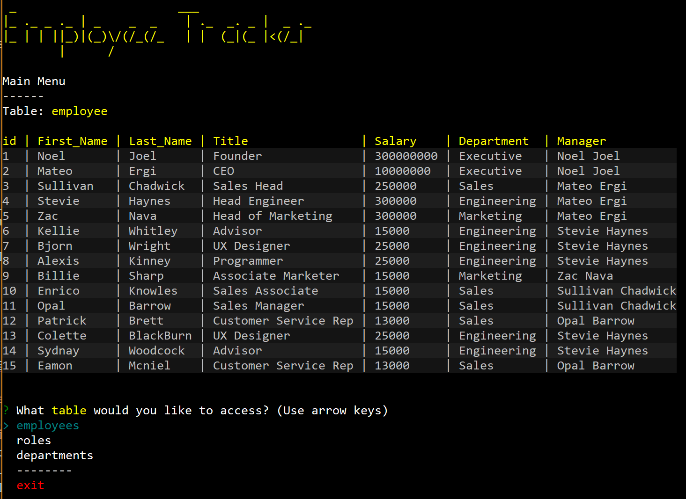

# Employee Tracker

## Description

[](https://opensource.org/licenses/MIT)


This project utilizes `node.js` and `npm` to create a employee manager within the command line. After a series of prompts, the user will be able to view and modify tables within a `mysql` database.

Row distinctions have been recolored! here is what the current code looks like in the CLI:



Here's a demonstration of the codes functionality with the old colors:


---
## Table of Contents 

* [Installation](#Installation)
* [Usage](#Usage)
* [Credits](#Credits)
* [License](#License)
* [Tests](#Tests)
* [Questions?](#Questions?)

---
## Installation

After downloading the code, open `gitbash` and navigate inside the main directory. Once there, run the command
```
npm install
```
and `inquirer`, `chalk`, `mysql`, and `util` will be installed automatically as they are specified in the `package.json` file.

## Usage

This project is meant to view and modify tables from a database set up in `MySQL Workbench`. 
To set up for usage open a query file in `MySQL Workbench` and copy paste the starter values in `seed.sql`.

Then, enter the local port the server is running on at line 14 in `index.js`.

## License

© 2020 [Clyde Baron Rapinan](https://github.com/clydebaron2000). Under the [MIT](https://opensource.org/licenses/MIT) license.

## Contributing

Feel free to contribute to this project.

## Tests

There are currently no automated tests for this repository.

## Questions?

Have questions about my project? [Email me](mailto:crapinan@ucsd.edu) at crapinan@ucsd.edu.

---
Check out my other projects [here!](https://github.com/clydebaron2000)
